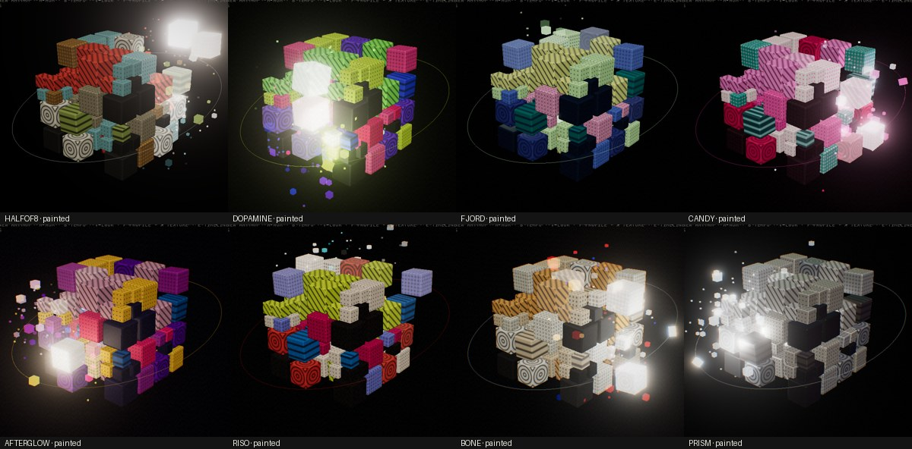
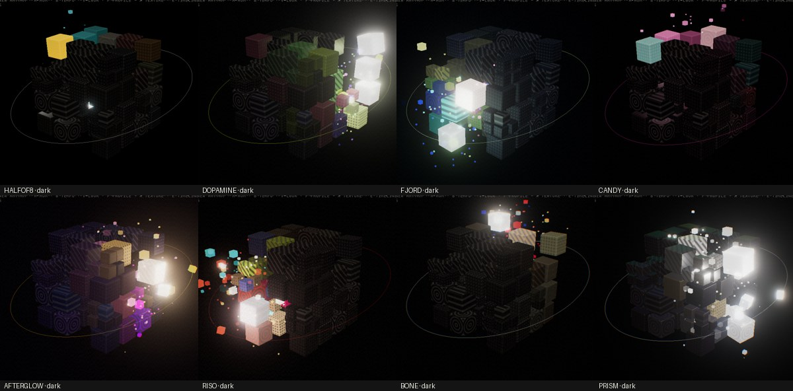
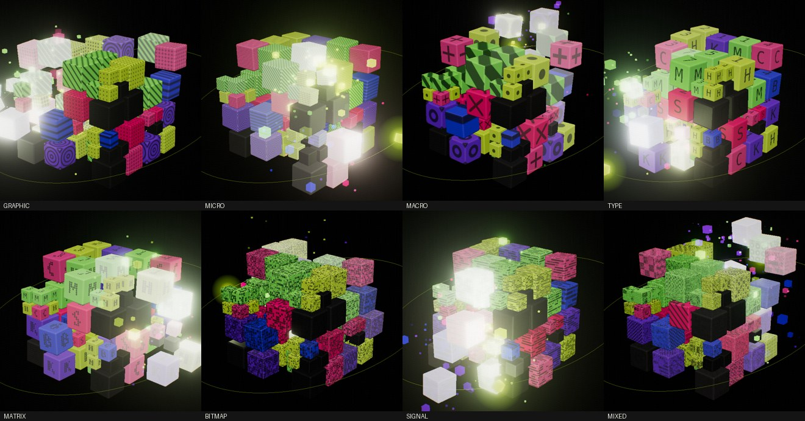
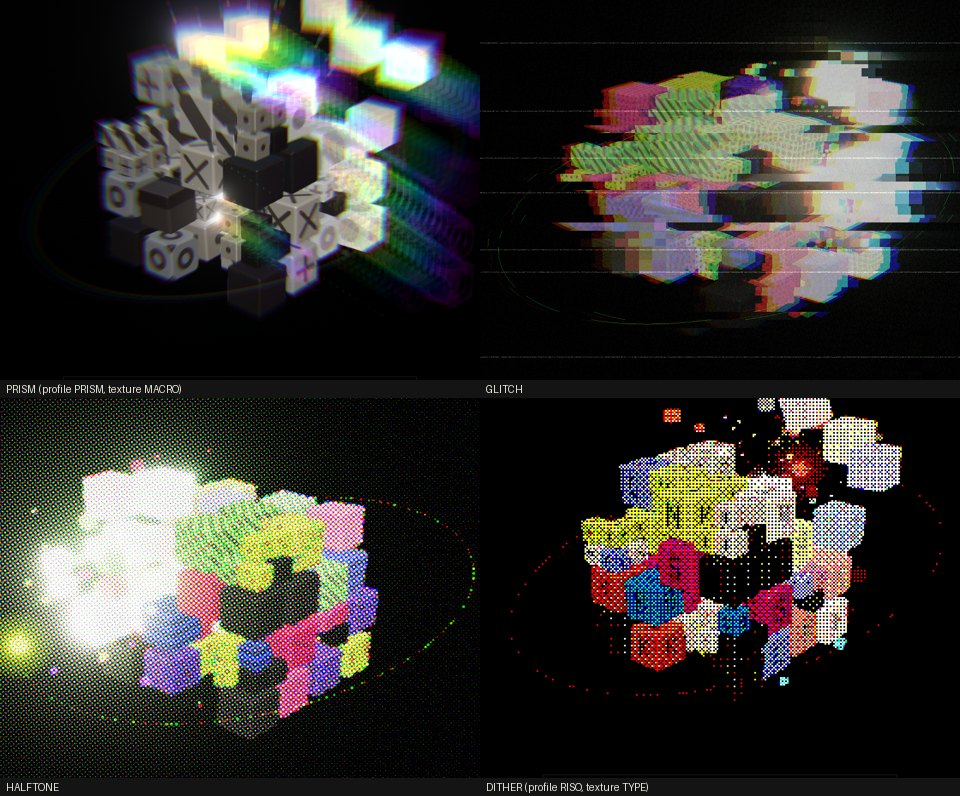

# Colour profiles, texture sets and shader styles

This document is based on the 51 references in `references.zip`:
* `colors/`: 30 palette cards, gradient studies and renders.
* `patterns/`: 20 pattern boards and a 5-second video.

Reference names below (c00…c29 for colours, p00…p19 for patterns) follow the files in
alphabetical order inside each folder. Hex values come from two sources: the values printed on
the cards, and k-means clustering (6 clusters) of the images that don't print them (gradients,
renders, the video).

| PAINTED | DARK |
|---|---|
|  |  |

## What the references say

**Colour.** The colour references group into five families:

| Family | References | What it is |
|---|---|---|
| Neon "dopamine" pairs | c04 c05 c08 c09 c10 c14 c15 c17 c25 | Acid lime `#D0F600`, hot magenta `#FF007F`, electric cobalt `#3155FF`, digital violet `#7B3FF2`, electric blue `#00F5FF`, on jet or graphite black (`#0C0D10`, `#1C1C1C`). Always two or three at full saturation, nothing in between. |
| Soft contrast pairs | c02 c03 c11 c21 c22 c24 | A deep colour against a pale one: midnight fjord `#053264` with mint cream `#CCFFBC`, teal `#018081` with pinky `#FFCDF2`, deep ocean `#404D9B` with sugar blush `#FCB3DC`. |
| Pink ramps | c00 c01 c20 c28 c29 | Rose white to candy to magenta to cerise, with one cool accent (emerald `#00555F`, eastern blue `#16A5A3`). c29 is the same ramp as a radial halftone. |
| Gradients and line scans | c07 c16 c18 c19 c23 c26 c27 | Violet → flamingo → amber, sliced into vertical streaks or stepped bands. Clusters: `#7A00BA #FF387F #FCBF06 #00FFDB #F26F36 #246BB6`. |
| Glass and halftone renders | c06 c12 c13 | c13 is almost Volum3 itself: a cluster of white, silver and graphite cubes, some wire-meshed, with rainbow dispersion at the edges. c06 and c12 are dot-matrix gradients. |

**Pattern.** The pattern boards are 1-bit marks on a grid, used as a vocabulary:
* Halftone dot grids whose dot size carries the image (p07 p08 p03 p06).
* Ring outlines (p07 p17), X marks (p15 p12), plus signs (p11 p13) and checkerboards at several
  scales (p16 p00).
* Diagonal hatching and bar bands (p05 p10 p14 p09), and concentric targets (p17).

They are almost always two-tone (ink on ground), mixed tile by tile. The renders p18 (a "metal
cube" of extruded pixels) and p19 (glitch-sliced chrome) show the same grid language in 3D.

**The video** (`patterns/…_720w.mp4`, 5 s, 702×396) shows pixelated bone-white flower silhouettes
(`#E9E8DB`) on near-black. The edges dissolve into a dot/pixel dither, with red `#E4262C`, amber
`#EDAE54` and blue `#1F3FD9` fringes where the colour plates are out of register.

## Colour profiles (`src/profiles.js`)

A profile is a whole look: the cube colour per part, the ink its pattern is printed in, the rest
and peak colours, the marks thrown on a hit, the indicator's colour, the surface finish and the
post effects. Switch profiles with **P** or PROFILE in the top panel. The URL keeps `profile=`.

| Profile | From | Parts (kick · snare · hat · open · perc · bass · chord · melody) | Ink | Finish / FX |
|---|---|---|---|---|
| HALFOF8 | SQNCR's own palette | `#DDDACC #9F967E #79AFB4 #3D5B5D #4E5635 #9BAC5B #8C6A34 #E45237` | per part (SQNCR's fg) | matte; bloom 0.5 |
| DOPAMINE | c05 c08 c09 c10 c17 c25 | `#7B3FF2 #FF007F #D0F600 #00F5FF #FF8F1C #3155FF #FF4FA3 #88FF5F` | jet `#0C0D10` | satin; light fringe, grain |
| FJORD | c02 c03 c11 c21 c22 | `#404D9B #FCB3DC #CCFFBC #9AE1E2 #FFCDF2 #018081 #6186E4 #F1FB99` | midnight `#053264` | matte; soft bloom |
| CANDY | c00 c01 c20 c28 c29 | `#DA2864 #FF64BE #FFF5FA #FFBEE6 #FCD581 #00555F #16A5A3 #FF9AE9` | per part (deep sakura `#79023E`, emerald…) | satin; peak is rose white |
| AFTERGLOW | c07 c16 c23 c26 c27 | `#7A00BA #FF387F #FCBF06 #00FFDB #F26F36 #246BB6 #B335AD #E5A7C1` | night `#140835` | strongest bloom, fringe (line-scan feel); peak is warm white `#FFF1D6` |
| RISO | p06 p10 p11 p12 p15 p16 | `#E74C31 #DA236C #F5E7D9 #36D2D9 #EAB65A #2D82CE #8993EF #E1F318` | print black `#211718` | very matte, little bloom, heavy grain, slight misregistration; marks thrown in the four ink colours |
| BONE | the video, p04 p07 p09 | bone and paper `#EFEEE5 #E9E8DB #DCCBAD …`, amber `#EDAE54` for the melody | `#0B0B0E` | strong red/blue fringe; marks in red / amber / blue / bone, like the video's edges |
| PRISM | c13 p18 p19 | silvers and whites `#C4CCD8 #FAF7F1 #DEDBD5 … #FFFFFF` on graphite `#2A2C30` | `#463A3A` | metallic (0.55), glossy, thin-film rainbow at grazing angles, fringe |

Each profile also sets:
* `rest`: a cube at rest in DARK.
* `idle`: a cube with no note in PAINTED.
* `peak`: what a hard-thrown cube burns to.
* `accent`: the indicator, trail, orbit ring and touch circle.
* `glow`: how much light a struck cube gives off. Bright palettes need less, or bloom washes the
  frame out.

The background stays black; each profile only tints it slightly toward its darkest colour.

**How the looks use it.**
* **PAINTED**: every cube wears its part's colour with its pattern in the profile's ink. A struck
  cube glows and warms toward `peak`.
* **DARK**: cubes rest in `rest`, and their pattern is barely lighter, so there's no colour at
  all. A struck cube lights up in a boosted version of its part colour, and its pattern takes its
  ink as it lights. The further it's thrown, the closer it gets to `peak`. Near-neutral palettes
  (BONE, PRISM) aren't saturated further.

**FX** (`src/fxpass.js`). One pass runs on the finished image after bloom and tone mapping, so
amounts read as they look:
* `fringe`: a radial red/blue split, growing toward the edges (the video's misregistration and
  the renders' dispersion).
* `grain`: film or paper grain.
* a soft vignette.

## Texture sets (`src/textures.js`)

Texture sets work like colour profiles: each set says what is printed on each kind of cube, as
a pattern plus a scale. Switch with **X** or TEXTURE in the top menu; the URL keeps
`texture=`. Scale works in one of two ways:
* **Per unit**: a medium cube carries twice as many marks as a small one.
* **Per face** (`fit`): one mark or glyph per face, whatever the cube's size.

| Set | Scale | What each part gets | From |
|---|---|---|---|
| NONE | — | plain cubes | — |
| GRAPHIC | 4 per unit | kick: target · snare: X marks · hat: halftone dots · open: rings · perc: checkerboard · bass: bars · chord: plus signs · melody: hatching · no note: hairline grid | the pattern boards |
| MICRO | 9 per unit | the same marks, as a fine screen | p00, p08 |
| MACRO | 1 per face | the same marks, one big one per face (targets get 2–3 rings) | p07, p16, p17 |
| TYPE | 1 per face | **large letters and numbers**: the part's letter on the sides (K S H O P B C M); on top, the beat a drum lands on (1–4) or the scale degree a tuned part plays (1–7) | c09, p02 |
| DOT MATRIX | 1 per face | the same glyphs as a dot-matrix sign | p09, the flower video |
| BITMAP | 5–10 per unit | 1-bit pixel noise, denser for the heavy parts (kick 70 %, hat 25 %); it reshuffles while the cube is lit | p04, the flower video |
| SIGNAL | 3–10 per unit | broken horizontal bands that slide sideways when struck, like a bad video line | p10, p14 |
| MIXED | 2, 4 or 8 per unit | every face picks its own mark and scale | p12, p06 |

All marks are drawn in the cube shader (`src/cubes.js`), so they stay sharp at any distance, and
they swell when a cube is struck: dots grow, lines and glyphs get bolder, checkers fill in,
pixels reshuffle, bands slide. Glyphs come from an atlas drawn once on a canvas in DM Mono. The
dot-matrix version is made from the same letters by measuring how much of each cell of a 7 × 9
grid a letter covers.

## Shader styles (`src/styles.js`)

A style is how the finished frame is shown: one full-screen shader at the very end. It receives
the time and a beat pulse, which jumps on every kick and snare and fades, so the look moves with
the music. Switch with **S** or SHADER; the URL keeps `shader=`.

| Style | What it does | From |
|---|---|---|
| CLEAN | the frame as rendered | — |
| PRISM | **Splits light into its spectrum.** Every pixel is sampled 16 times along a line from the centre, each sample weighted by a band of the rainbow, so white edges fan out red-to-violet. It widens toward the edges and on the beat. Bright points also throw a spectrum streak beside them, like a beam through a prism. | c13, p19 |
| GLITCH | **A damaged digital video signal.** Slices tear sideways, blocks drop to low resolution, R and B split along the line, chroma smears, and the frame rolls now and then. Scanlines, noise lines and crushed colour are always there at a low level, and burst at random and on every kick and snare. | p14, p19, c27 |
| HALFTONE | an LED dot screen: rotated grids of red, green and blue dots sized by the colour beneath | c06, c12, c29 |
| DITHER | ordered 4 × 4 dither per channel on a coarse pixel grid; eight colours, near-black kept black | p04, the flower video |

The styles combine freely with the colour profiles, the texture sets and both looks. Each
profile's own fringe and grain still run before the style.

## Adding a profile

Add an entry to `PROFILES` in `src/profiles.js`: 8 part colours, an ink (one colour, or one per
part), `rest`, `idle`, `peak`, `accent`, `marks` (`'lane'` or a list of colours), `material`
(`roughness`, `metalness`, `iridescence` 0/1) and `fx` (`bloom` [strength, radius, threshold],
`glow`, `fringe`, `grain`). It will appear in the PROFILE switch. To add a texture set, add an entry to `TEXTURE_SETS` in `src/textures.js`: a `{ pattern, density,
fit?, fill? }` for each part and for `idle`. To add a new pattern, add a branch to `patternMask`
in `src/cubes.js` and give it an id in `PATTERNS`. To add a shader style, add a fragment shader
to `SHADERS` in `src/styles.js` and an entry to `STYLES`.
